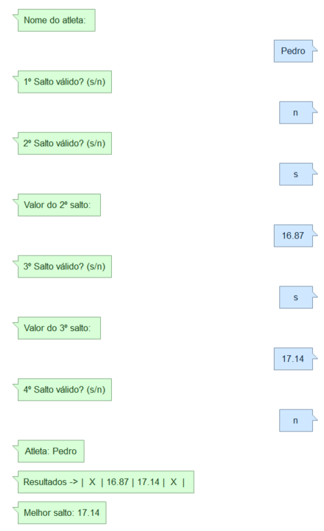
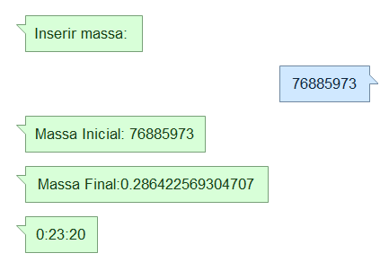
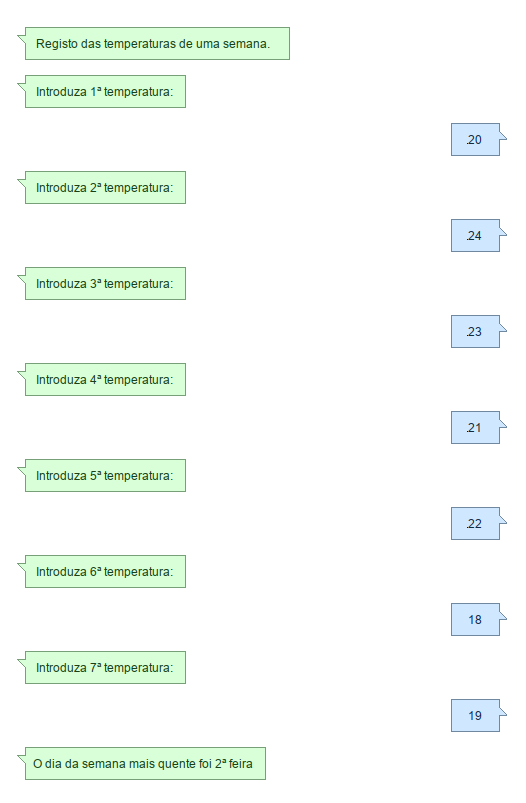
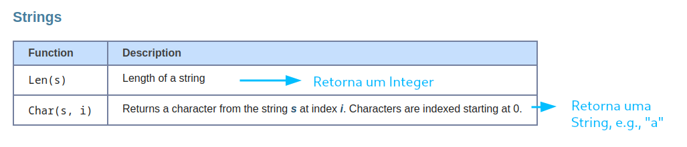
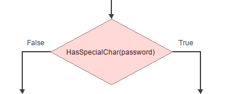

# Lab 2 - Descrição de algoritmos com **fluxogramas** (ciclos, arrays e funções)

## Aplicação Flowgorithm

Deverá desenvolver os seguintes algoritmos com recurso à aplicação [Flowgorithm](http://www.flowgorithm.org/index.html).

Recomenda-se que elabore cada algoritmo como uma _função_ independente, através de `Program > AddFunction...` .

Para alternar entre a execução de exercícios diferentes, adicione apenas um bloco `Call` no algoritmo `Main`, invocando o algoritmo respetivo.

:warning: Não se esqueça de guardar o seu trabalho! A aplicação permite guardar o "projeto" através de `File > Save As...` (ficheiro com extensão `.fprg`). Mais tarde, pode voltar a abri-lo na aplicação.

## Exercícios :pen:

1. Crie um algoritmo (`EvenRange`) de um programa que solicita ao utilizador os limites inferior e superior de um intervalo aberto de números naturais e **imprima todos os números pares no intervalo** e a **soma** destes.

     

    :keyboard: Execução exemplificativa desejada:

    

---

2. Crie um algoritmo (`TripleJump`) de um programa que regista os resultados dos saltos realizados por um atleta. 
   
     

    No triplo salto os saltos efetuados podem ser considerados _válidos_ ✅ (com registo da marca) ou _inválidos_ :x:. Cada atleta tem 4 tentativas.  

     

    Solicite o nome do atleta, assim como os resultados das 4 tentativas. Deve ser mostrada a seguinte informação: nome do atleta, resultados obtidos e o melhor resultado. 

    :bulb: Guarde o registo das várias marcas num _array_ de um tipo apropriado (terá de decidir que valor guardar no caso de um salto inválido).

     

    :keyboard:  Execução exemplificativa desejada:

    

---

3. Um determinado material radioativo perde metade da sua massa a cada 50 segundos.  
   
    
   
   Crie um algoritmo (`RadioactiveMaterial`) de um programa que solicita uma massa inicial (em gramas) e calcula o tempo necessário para que essa massa se torne menor que 0.5 gramas.  
   
    
   
   🅰️ Na primeira versão do programa, devem ser mostrados:  
      - a massa inicial;
      - a massa final, e;
      - o tempo necessário calculado (em segundos).
  
    :arrow_right: Elabore este algoritmo e teste-o.

     
   
    🅱️ Será mais agradável apresentar ao utilizador o tempo necessário em `horas:minutos:segundos`.

     

    Crie um algoritmo (`ConvertSeconds`) de uma função que **recebe como parâmetro uma duração de tempo** (em segundos) e **retorna o tempo** (em texto) no formato `"<horas>:<minutos>:<segundos>"`.

     

    :bulb: Terá de utilizar o operador módulo `%` para calcular o número de horas e minutos contidos numa duração de tempo em segundos (1h = 3600s; 1m = 60s).

    :bulb: Pode atribuir a uma variável do tipo `String`  o conteúdo de uma _concatenação_, e.g., `texto = h & ":" & m & ":" & s`, onde `h`, `m` e `s` são variáveis que contêm o valor das horas, minutos e segundos, respetivamente.

     

    Utilize esta função no algoritmo `RadioactiveMaterial` para agora apresentar o tempo necessário no formato pretendido.
   
     

    :keyboard: Execução exemplificativa desejada do programa final:
   
    

---

4. Crie um algoritmo (`Temperatures`) de um programa que regista todas as temperaturas atmosféricas de uma semana e mostra qual foi o dia "mais quente" 🌡️. Vamos considerar que a semana começa no Domingo e acaba no Sábado. 

     

    O programa deverá apresentar no final o **nome do dia** mais quente da semana.
    
     

    Para esse efeito, crie o algoritmo (`DaysWeek`) de uma função que **recebe como parâmetro um dia de semana** (pode decidir se é $[0, 6]$ ou $[1,7]$ e **retorna o nome do dia** da semana correspondente; se a função receber um dia inválido, devolve `"(Dia inválido)"`.

     

    :keyboard: Execução exemplificativa desejada:
    
    
    
    

---

5. Crie um algoritmo (`CreatePassword`) de um programa que solicita que seja criada uma _password_ com 5 caracteres, seguindo determinados regras, para validação posterior.

     

    O Flowgorithm possui algumas [funções disponíveis](http://www.flowgorithm.org/documentation/language/intrinsic-functions.html) para trabalhar com *strings*, nomeadamente:

     

    :bulb: Isto significa que uma *String* pode ser considerado um "array de caracteres", onde o primeiro caractere ocupa a posição `0`. Logo, `Len("Olá")` retorna `3` e `Char("Olá", 1)` retorna `"l"`.

     

    :muscle: Considere a seguinte abordagem _bottom-up_, utilizando **funções** para realizar diferentes tarefas que serão compostas para obter a solução final. As funções a implementar são as seguintes:

    1. `PrintRules` - enumera (apenas apresenta ao utilizador) as regras a obedecer:

       - "O primeiro carácter tem de ser um dígito." 

       - "Tem de conter pelo menos um dos seguintes caracteres: `#`, `*` ou `@`."

    2. `IsFirstDigit` - **recebe por parâmetro uma string** e verifica se o primeiro caractere é um dígito, i.e., **retorna um valor _booleano_**.

    3. `HasSpecialChar` - **recebe por parâmetro uma string** e verifica se nesta existe, pelo menos, um dos caracteres `#`, `*` ou `@`. 

    4. `HasLength` - **recebe por parâmetros uma string e um tamanho** (Integer) e verifica se a _string_ tem o tamanho especificado no segundo parâmetro.

     

    Implemente o algoritmo `CreatePassword`, utilizando estas quatro funções. Deve mostrar se a password criada é válida (cumpre todas as regras) ou se é inválida, mencionando o erro encontrado.

    :bulb: Se eu tenho uma função que retorna um _booleano_, posso invocar essa função para determinar uma condição, e.g.:

    

---

paula.miranda@estsetubal.ips.pt e bruno.silva@estsetubal.ips.pt